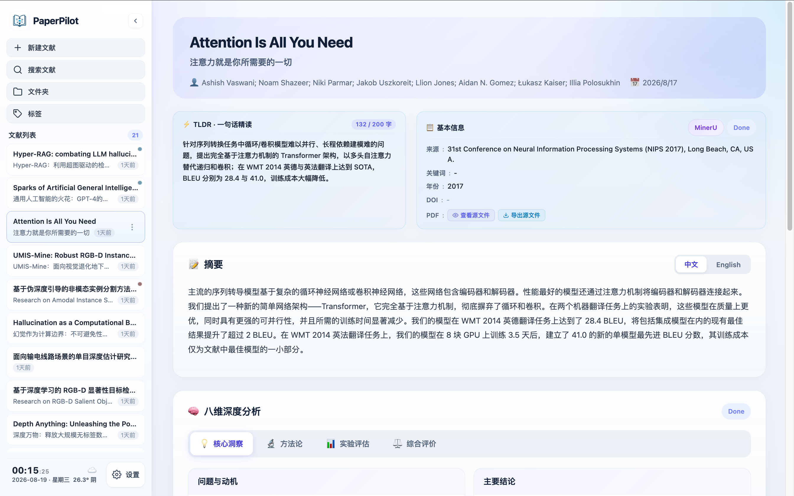
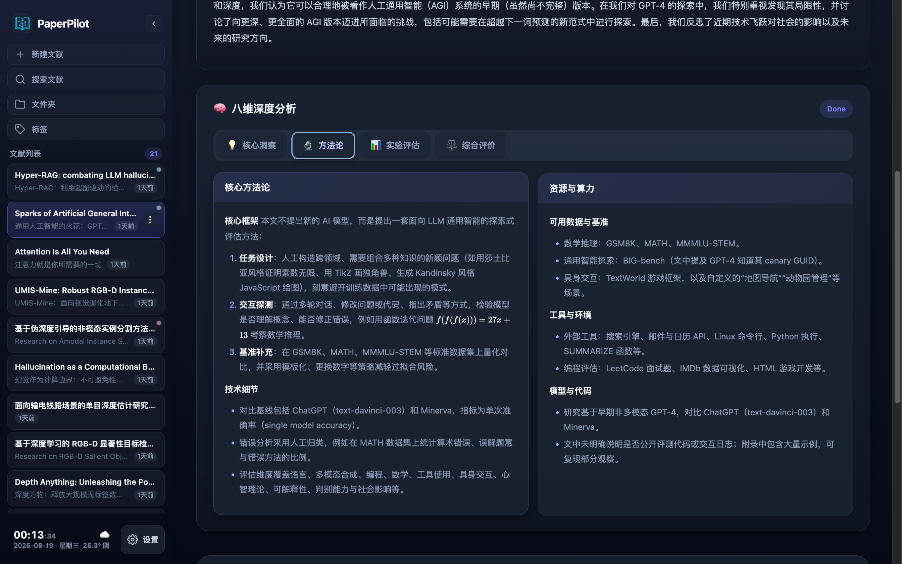
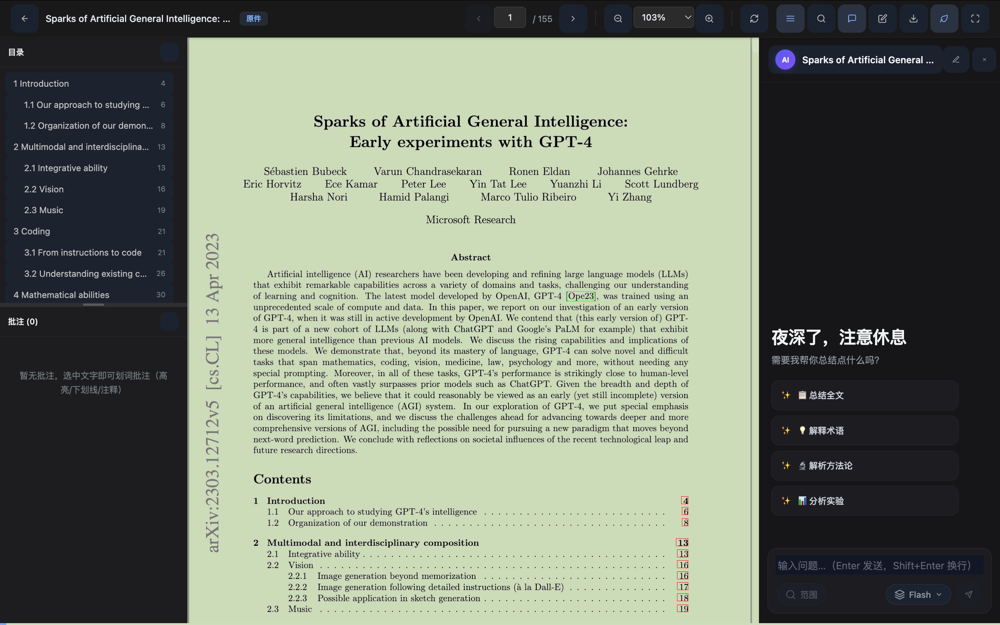
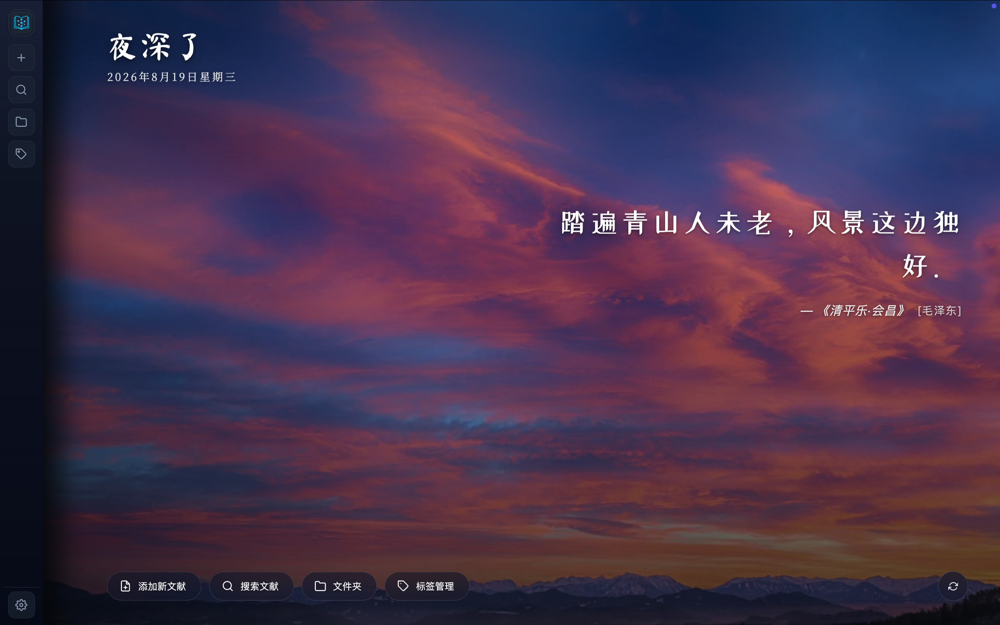
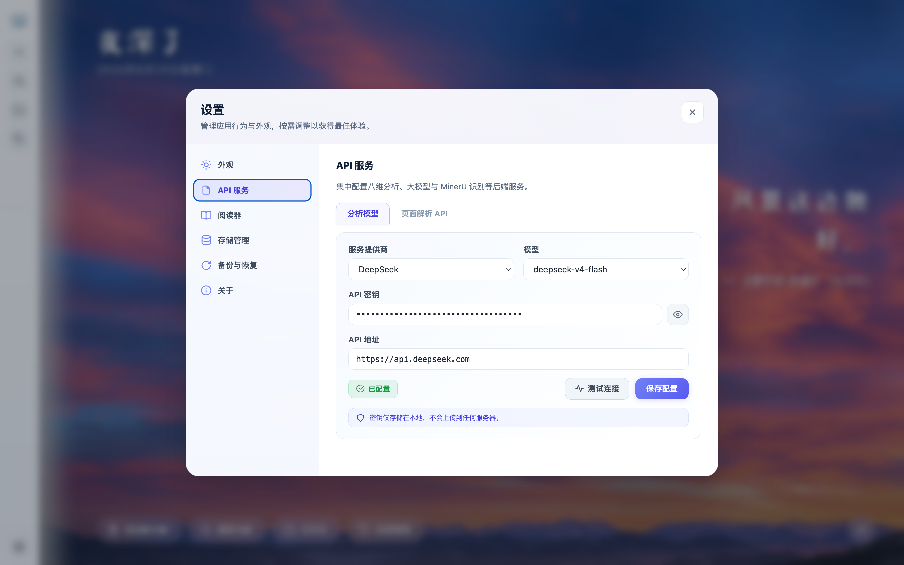
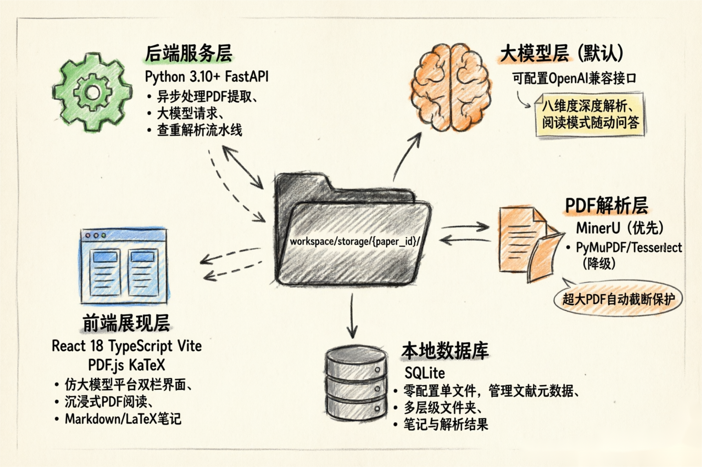

<p align="center">
  
</p>

<h2 align="center">Navigate the Knowledge Ocean. Your Co-pilot Through Every Paper.</h2>


<p align="center">
  <a href="https://react.dev/">
    
  </a>
  <a href="https://fastapi.tiangolo.com/">
    
  </a>
  <a href="https://www.sqlite.org/">
    
  </a>
  <a href="https://platform.deepseek.com/">
    
  </a>
  <a href="./LICENSE"></a>
</p>

<p align="center">
  一套完全运行于本地的论文管理与 AI 智能分析系统。数据与文件持久化在本地沙盒，核心科研资产绝对隐私；通过大语言模型与本地 RAG，打通“文献管理 — 智能解析 — 沉浸式阅读 — 个人笔记”的科研全工作流。
</p>

---

## 🖼️ 界面预览

<p align="center">
  
</p>
<p align="center">
  
  
</p>
<p align="center">
  
  
</p>

## ✨ Why PaperPilot?

PaperPilot 主打三件事：**简单、AI 辅助、纯本地**。

- 🏠 **纯本地部署（Local-First）**：前后端分离，所有数据与 PDF 文件持久化在本地沙盒（`workspace/storage/`），SQLite 单文件数据库零配置；
- 🤖 **AI 辅助分析**：上传 PDF 自动触发「MinerU 解析 → 元数据智能提取 → 八维度深度解析」流水线；八维度覆盖 *问题与动机 / 核心方法论 / 实验设计 / 资源与算力 / 实验充分性 / 主要结论 / 论文优点 / 局限与不足*；沉浸式阅读模式下，右侧 AI 问答侧边栏支持全文问答与框选段落即时提问。
- 🎯 **简单易用**：开箱即用——无需租服务器、无需手改 `.env`，克隆仓库 → 启动前后端，浏览器即获完整体验；所有 API Key 均可在应用内「设置」可视化填写，新手 5 分钟即可跑通全流程。配合类 VSCode 的多层级文件夹树、拖拽整理、浅色 / 深色 / 跟随日出日落的自动主题与个性化欢迎页（壁纸 + 诗句），让科研阅读既高效又沉浸。

### 更多特性

- 📚 **仿大模型平台双栏界面**：左侧控制栏 + 右侧三段式卡片（基础元信息 / AI 深度解析 / 我的学术笔记）。
- 🔍 **常驻模糊检索 + 双重时间排序**：对标题（中英）、作者、标签、年份毫秒级匹配；支持按入库时间与论文发表时间切换排序。
- 🏷️ **多维度标签体系**：扁平多对多标签，与文件夹正交——一篇文献可同时归属一个文件夹与多个标签；标签名大小写不敏感自动去重、柔和预设色板（拒绝荧光色）；支持重命名 / 改色 / 删除（级联清理链接）/ 多标签一键合并，以及批量给多篇文献打标或移除，侧边栏按标签色点快速识别。
- 💾 **完整备份，无损导出**：一键打包导出原件、翻译件、AI 分析结果与个人笔记，支持整库数据备份，迁移、归档与跨机流转无忧。
- 🛡️ **查重检测 + 断点续析**：上传即比对库内重复，分析失败可一键重试（支持复用已有 MinerU 结果或强制刷新）。
- ✍️ **富文本笔记**：支持 Markdown / LaTeX 公式 / 本地图片拖拽粘贴，沉淀私人批注。
- 🎨 **主题与个性化**：浅色 / 深色 / 自动（跟随本地日出日落）；个性化欢迎页按时段切换壁纸与诗句。

## 🧭 适用场景

- 🎓 **个人论文图书馆**：沉淀自己的研究方向，持续积累阅读脉络与笔记。
- 🧪 **实验室 / 课题组**：私有部署，数据不出本机，适合做团队内部的论文管理与阅读入口。
- 📚 **日常阅读工作台**：把发现、解析、阅读、问答、笔记集中到一个入口。

## ⚙️ 架构概览

<p align="center">
  
</p>

## 🚀 快速启动

> [!TIP]
> 准备好两枚 API Key（大模型 + MinerU），即可克隆、启动后端与前端，随后在浏览器「设置」里可视化配置 API 即可开始使用。

### 1) 🔑 准备 API Key

PaperPilot 需要两枚 Key，可先去获取，启动系统后再在「设置」里填入：

- **大模型 API Key**（默认 DeepSeek，也支持任意 OpenAI 兼容接口）
  - 打开 [DeepSeek 开放平台](https://platform.deepseek.com/) → 注册 / 登录 → 创建 API Key
- **MinerU API Token**（用于 PDF 高精度解析；不配置会自动降级到本地 PyMuPDF 提取）
  - 打开 [MinerU Token 管理](https://mineru.net/apiManage/token) → 注册 / 登录 → 创建 Token

### 2) 📦 克隆仓库

```bash
git clone https://github.com/Leo-bcu/PaperPilot.git
cd PaperPilot
```

### 3) ▶️ 启动后端

```bash
cd backend
pip install -r requirements.txt
uvicorn app.main:app --reload --port 8000
```

后端默认运行在 `http://localhost:8000`，健康检查：`GET /health`。

<details>
<summary>想用虚拟环境隔离依赖？（可选）</summary>

直接调用虚拟环境内的 `pip` / `uvicorn` 即可，无需 `source activate`（该命令在 Windows 下也不通用）：

```bash
cd backend
python -m venv .venv
# macOS / Linux
.venv/bin/pip install -r requirements.txt
.venv/bin/uvicorn app.main:app --reload --port 8000
# Windows
.venv\Scripts\pip install -r requirements.txt
.venv\Scripts\uvicorn app.main:app --reload --port 8000
```

</details>

### 4) 🌍 启动前端

```bash
cd frontend
npm install
npm run dev
```

前端开发服务器运行在 `http://localhost:5173`，已通过 Vite 代理将 `/api` 请求转发到后端 `8000` 端口。

### 5) ✅ 浏览器访问

打开：

```text
http://localhost:5173
```

### 6) ⚙️ 在「设置」中可视化配置 API（推荐）

系统启动时无需预先配置 `.env`，进入应用后点击右上角「设置 → API 设置」，即可可视化填入：

- 大模型 Provider / Base URL / 模型名 / API Key
- MinerU Token / 模型版本 / Base URL

保存后即可上传 PDF，自动触发「MinerU 解析 → 元数据提取 → 八维度深度分析」全流程。

> 也支持通过 `.env` 文件预配置（复制 `.env.example` 为 `.env` 后填写），两种方式任选其一；可视化配置会覆盖 `.env`。

<details>
<summary>生产构建（可选）</summary>

```bash
cd frontend
npm run build      # 产物输出到 frontend/dist
```

构建产物使用相对路径（`base: './'`），可由后端或任意静态服务器托管，支持子路径部署。

</details>

## ❓ FAQ

### 💻 需要服务器吗？

不需要。PaperPilot 完全运行在本地，数据、文件、数据库均存放在本机沙盒，适合对隐私敏感的科研场景。

### 🔒 数据会上传到云端吗？

不会。除调用大模型 API 解析论文（仅发送提取后的文本片段）外，PDF 原件、笔记、数据库均不离开本机。

### 🎛️ 可以换其他大模型吗？

可以。应用内「设置 → API 设置」支持配置任意 OpenAI 兼容接口（自定义 Base URL、模型名、API Key），DeepSeek 仅为默认示例。

### 📄 没有配置 MinerU 还能用吗？

可以。系统会自动降级到 PyMuPDF（必要时叠加 Tesseract OCR）提取文本，仅解析精度略有差异。

### 👨‍🔬 适合团队使用吗？

适合。私有部署、数据隔离的特性使其非常适合作为实验室或课题组的内部论文管理与阅读平台。

## 💬 欢迎交流

如有问题、建议或使用心得，欢迎通过`KaiyuLi2025@163.com` 反馈。

## 📄 License

本项目基于 [MIT License](./LICENSE) 开源，欢迎学习、使用与二次开发。
